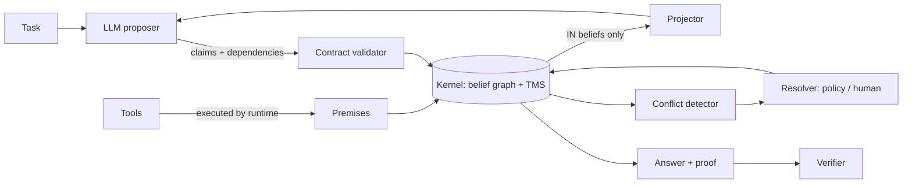

# Architecture and guarantees

This page describes how Corollary works inside, what it guarantees, and where those guarantees stop.

## The key inversion

**The model doesn't own the state; the runtime does.** In a message-log agent, the model's output
*is* the state: whatever it wrote at step 3 is read back at step 40 with the same authority as a tool
result. In Corollary the model is a stateless proposer. It never sees a transcript and never writes state
directly. It receives a context built by the runtime, and can only respond with structured claims, which
the runtime validates before accepting.

## Components

| Module | Responsibility | Uses a model? |
|---|---|---|
| `kernel` | Belief graph, labeling, retraction, re-derivation, conflicts, persistence | No |
| `formula` | Restricted arithmetic evaluator for `{key}` formulas | No |
| `contract` | Parses model responses into actions | No |
| `projector` | Renders `IN`, unconflicted beliefs into a prompt | No |
| `agent` | Run loop: project, propose, validate, apply; repair, reverify, narrow | Yes, as a proposer |
| `verify` | Deterministic checks over proofs | No |
| `resolvers` | Conflict resolution policies | No (except `AskHuman`, which asks a person) |
| `models` | Adapters from `complete(system, prompt)` to providers | Yes |

Only `agent` and `models` ever call a model, and nothing a model returns reaches the kernel without
passing through `contract` and the agent's validation.

## The kernel

### Data model

- **Nodes** are belief revisions (`key@n`). Each holds an immutable `Belief`, its justifications, a
  computed status, its current supporting justification, and a retraction flag.
- **Justifications** are hyperedges from a set of antecedent refs, plus a set of `unless` keys, to one
  conclusion ref. Antecedents are pinned to revisions. Recipe `inputs` are kept as keys, for
  re-derivation.
- **Indexes** map each node to the justifications that consume it, and each key to the justifications
  that it can defeat through `unless`.

### Labeling

A node is `IN` iff it is not retracted and some justification is valid. A justification is valid iff it
hasn't expired, all antecedents are `IN`, and no `unless` key has an `IN` revision. Corollary computes the
**least fixpoint** of these equations, which makes support well-founded.

When something changes (an assertion, a retraction, a new justification, an expiry), the kernel:

1. collects the **region**: the changed nodes plus everything reachable downstream through consumer and
   `unless` edges;
2. computes the region's **strongly connected components** (iterative Tarjan) and orders them so
   dependencies come first;
3. for each component in order: rejects it if an `unless` edge stays inside the component (an odd loop,
   see below), resets its members to `OUT`, and iterates to a fixpoint, marking a member `IN` as soon as
   one of its justifications is valid;
4. records every net status change, with a reason, in dependency order.

Nodes outside the region are untouched. Their labels can't depend on the change, so the cost of a
change is proportional to the size of the affected region, not of the base.

### Non-monotonic justifications and odd loops

`unless` makes the system non-monotonic: adding a belief can remove another. Corollary supports
**stratified** non-monotonic graphs, where no belief depends on its own absence. If adding a
justification would create a cycle containing an `unless` edge, the kernel raises
`CircularDefeatError`, restores every label it touched, and removes the justification (and its
conclusion node, if that was new). The base is left exactly as it was.

### Re-derivation and early cutoff

`propagate()` walks the latest revisions that are `OUT`, not retracted, and have a re-derivable
justification, in **dependency order**: a candidate is re-derived only after the candidates among its
recipe inputs, so a conclusion is never re-derived from an input that is itself about to change.
Creation time (then the belief key) only breaks ties between candidates that don't depend on each
other; it can't be relied on for order, since coarse clocks can give equal timestamps. For each, it
resolves the recipe's input keys to their current believed revisions and:

- for a **rule**, re-runs it;
- for a **model** justification, calls the re-deriver (the agent), which asks the model with a context
  scoped to those inputs and validates the result.

If the new value equals the old one, the old node gains a new justification pinned to the new inputs and
comes back `IN`, together with its dependents: **early cutoff**, as in incremental build systems.
Otherwise a new revision is created. Rounds repeat until no more progress is made.

### Confidence

Effective confidence is computed over every valid justification of a belief:

- premises from independent origins combine by noisy-OR, each counting its source's learned reliability
  (from the `TrustLedger`) times its freshness;
- a derived justification counts its step's confidence times the minimum of its antecedents';
- the belief takes the strongest of these.

Because non-support justifications can form cycles, confidence is computed as the **least fixpoint** of
these equations, by iterating from zero over the antecedent closure of the queried belief. Every operation
is monotone and never amplifies its inputs (min, max, products of values in [0, 1], and noisy-OR over
premises only), so cycles can't inflate values and the iteration converges. Results are cached, keyed on
the graph version, the ledger version, the trust policy and, when any evidence decays, the time (at
millisecond granularity). See [Confidence](guides/confidence.md) for the model itself.

## Guarantees

These properties are enforced by code, independent of model behavior. Each is covered by the test suite.

1. **No under-retraction under the conservative policy.** When a belief goes `OUT`, every belief whose
   justifications depended on it goes `OUT` too, unless it has other, independent valid support. Under
   `Dependencies.CONSERVATIVE`, a model claim depends on every belief in the context it was generated
   from. So a retracted fact can't silently survive in a model conclusion. The policy may
   over-retract, and that is the trade-off.
2. **Retracted facts are absent from model contexts.** The projector renders only `IN`, unconflicted beliefs
   above the confidence threshold. There is no transcript for a wrong fact to leak from.
3. **Tool results can't be fabricated.** Tool premises are created only by the runtime executing a
   registered tool with signature-validated arguments.
4. **Claims can't use what the model couldn't see.** A claim's dependencies must have been visible in that
   turn's context, or claimed earlier in the same response. Results of tools called in the same response
   are rejected.
5. **Formulas are re-executed.** A claim with a formula is accepted only if the formula, evaluated by a
   restricted interpreter over the antecedent values, reproduces the stated value. The verifier re-executes
   it again.
6. **Citations are span-checked.** A cited quote must appear in the registered document and state the cited
   value.
7. **Conflicts are never resolved silently.** Disputed keys can't support new conclusions and are hidden
   from the model until a person or an explicit policy resolves them.
8. **Labels are well-founded and consistent.** Circular support never makes a belief `IN`, and odd loops
   are rejected rather than producing an unstable labeling.
9. **Nothing is deleted.** Retracted and superseded revisions remain, with reasons, so every past
   conclusion can still be explained.

## Limits, stated honestly

Corollary makes the model's honesty irrelevant to whether bad facts *propagate*. It doesn't make the
model right, and some failure modes remain outside what code can enforce:

- **Parametric knowledge.** The projector controls what the model sees, not what it knows from training.
  A model can state a figure that appears nowhere in its context. Formulas and `NumericProvenanceCheck`
  catch this for numbers. A wrong *qualitative* judgement grounded only in training data is not caught.
  It will, however, be re-derived whenever its inputs change.
- **Declared dependencies can be confabulated.** Under `Dependencies.DECLARED`, the model's `follows_from`
  is trusted. A claim may depend on something it didn't declare. Use the conservative default, or narrow
  by ablation, when that matters.
- **Ablation is approximate.** `narrow()` prunes a dependency when the model reproduces the same value
  without it. Model outputs vary, so narrowing can keep a dependency it could have pruned (safe), and on
  rare occasions prune one it shouldn't have, when the model reaches the same value for a different reason.
- **Granularity is up to you.** Coarse claims ("the company is healthy") make cascades blunt. Fine-grained
  claims make graphs larger. Atomic claims with formulas give the best repairs and the strongest
  verification.
- **Equivalence is syntactic.** Two differently worded claims are different beliefs unless they share a
  key. Value equality uses a numeric tolerance and exact comparison otherwise.
- **Tools are trusted to be what they say.** Corollary records where a value came from and how much that
  source is trusted. It can't tell whether the tool itself returned the right number.
- **Single-process, not thread-safe.** A `BeliefBase` is an in-memory structure. Use one per thread, or
  synchronize access.

These are also the [open problems](https://github.com/gabe-santana/corollary#open-problems-we-want-help-with)
where contributions matter most.
